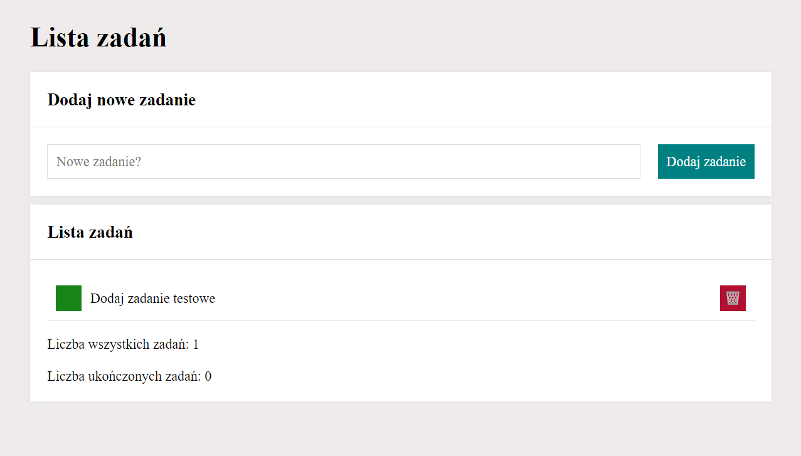
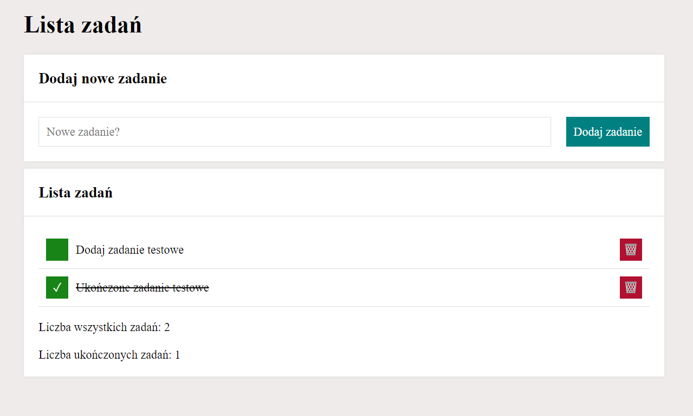
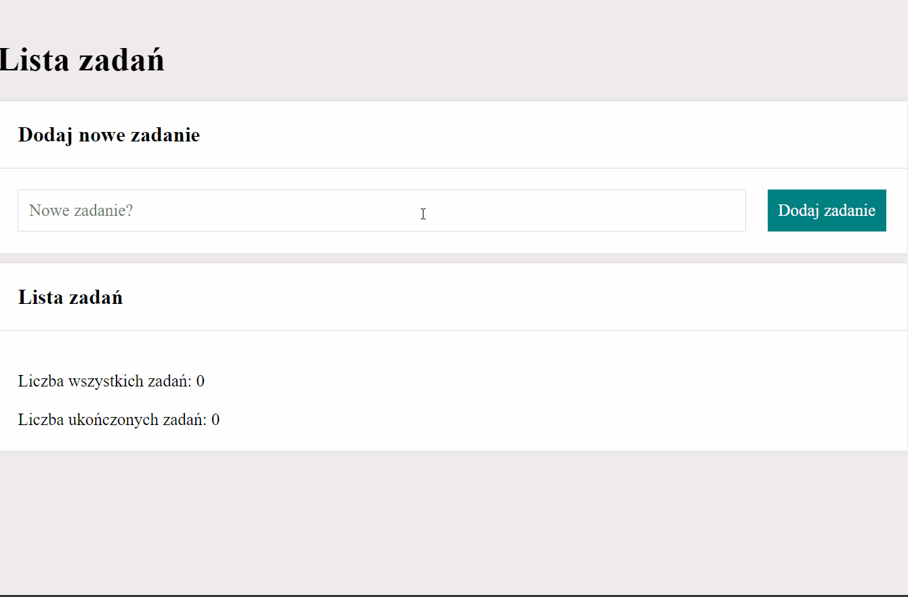

# Aplikacja ToDo

Witaj w aplikacji **ToDo**! Ta prosta aplikacja internetowa pomoże Ci zarządzać swoimi zadaniami i utrzymać porządek. Niezależnie od tego, czy jesteś studentem, profesjonalistą, czy po prostu osobą, która chce śledzić codzienne obowiązki, ta aplikacja jest dla Ciebie.

## Funkcje

- Dodawanie nowych zadań.
- Oznaczanie zadań jako ukończone.
- Filtracja zadań według statusu (ukończone lub oczekujące).
- Usuwanie ukończonych zadań.
- Projekt responsywny dostosowany do komputerów i urządzeń mobilnych.

## Wykorzystane Technologie

- JavaScript
- HTML
- CSS

## Zrzuty Ekranu i Demo

## Współpraca

Chętnie przyjmiemy Twoje sugestie i poprawki! Jeśli zauważysz jakieś problemy lub masz pomysły na ulepszenia, śmiało twórz pull requesty.

## Autor
**Milosz Szczepaniak**

